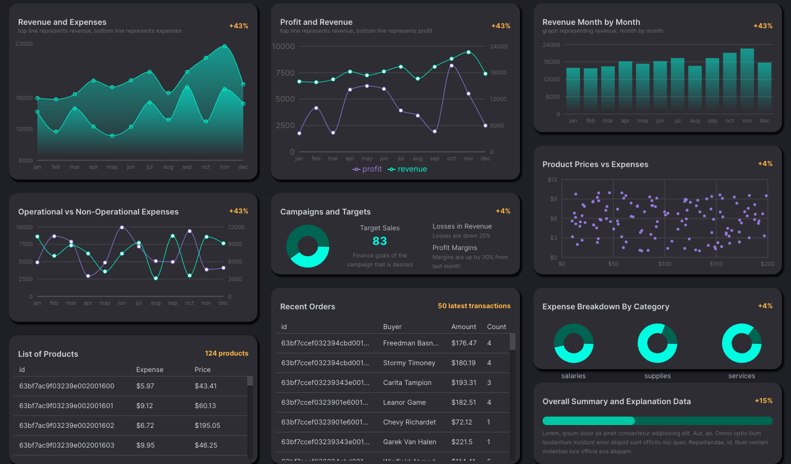
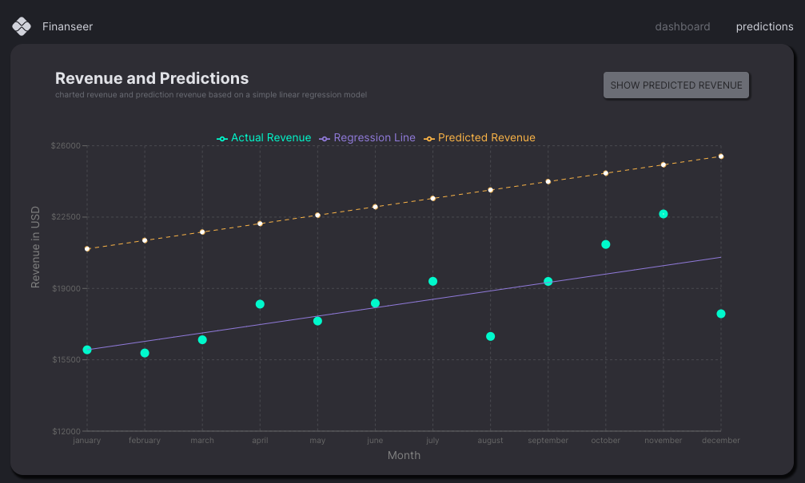

# FINANSEER - A sample finance dashbaord

## TECH STACK
- UI: React + MUI
- DB: Mongo, mongoose-currency for formatting money
- [server](): Node(Express)
- state: RTK
- Charts: [recharts]( https://recharts.org/en-US/)

- ML: [Regression-js](https://github.com/Tom-Alexander/regression-js): Use linear least-squares fitting methods to predict next year's revenue

<!-- [See live ] -->

See Ed Roh's [youtube](https://www.youtube.com/watch?v=uoJ0Tv-BFcQ) tutorial